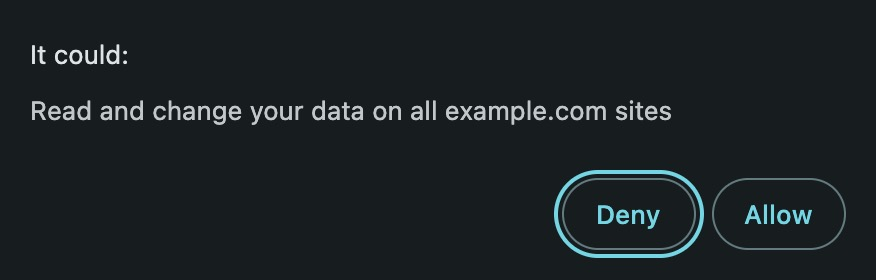
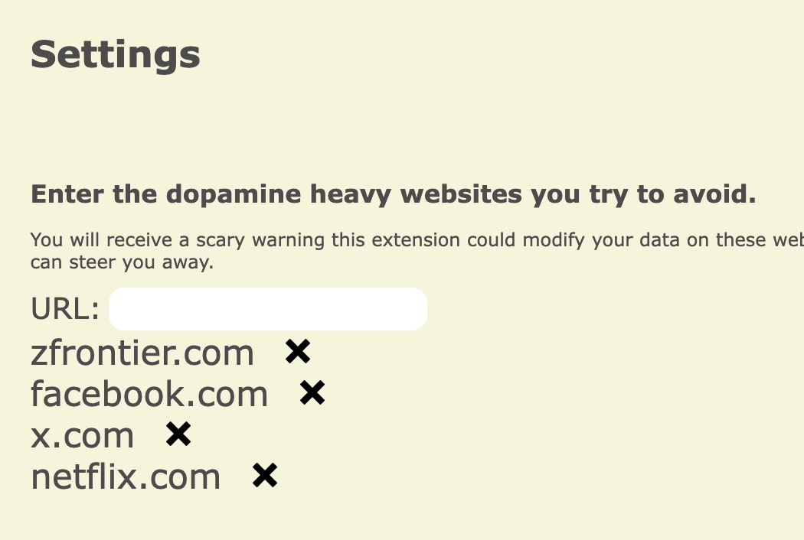
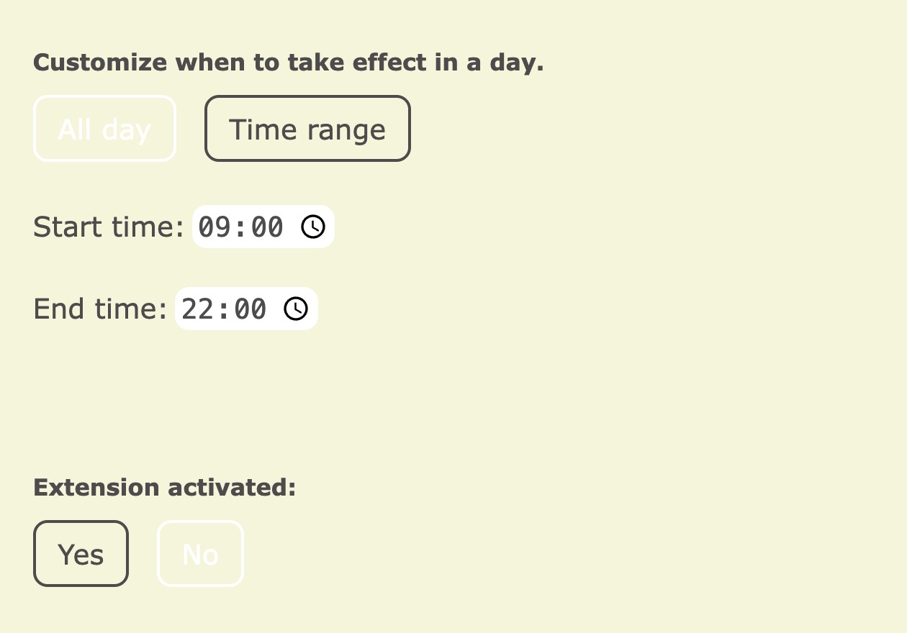
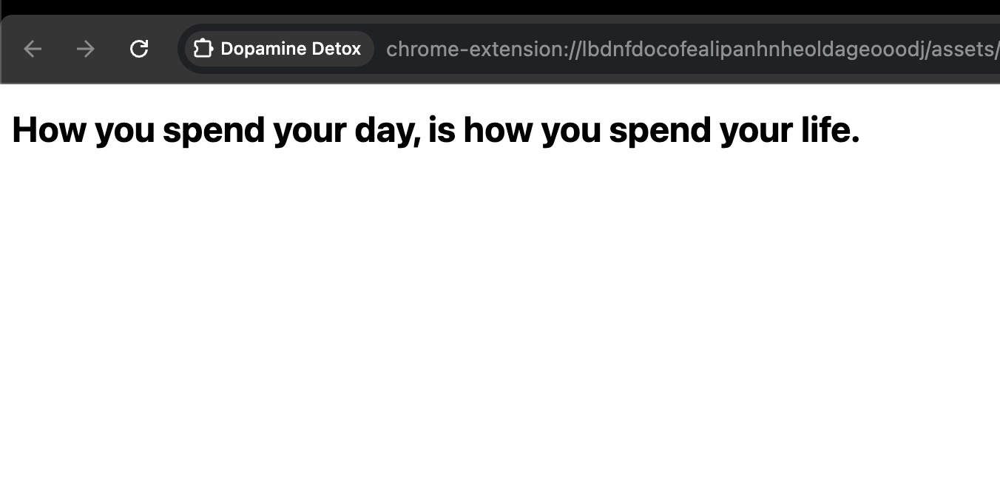
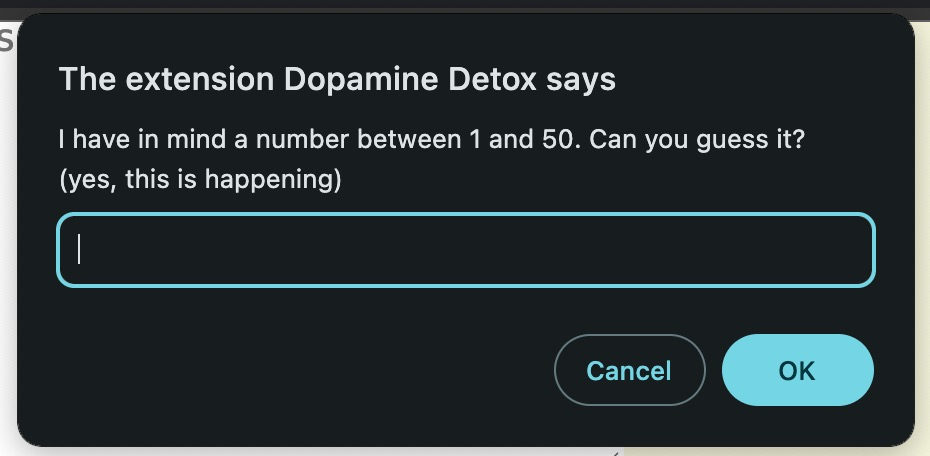

# Dopamine Detox (Chrome Extension)

This is one of those browser extensions help limiting usage on dopamine heavy websites.

Why write my own? Because this sounds a bit scary. 

Writting my own extension so that I don't have to worry about it sending sneaky network requests.

### Super easy to install
1. Clone or download this repo
2. Visit chrome://extensions/ in Chrome
3. Toggle on "Developer Mode"
4. Click "Load unpacked"
5. Select this repo, the plugin will be loaded and ready to use
6. Find this plugin icon in "Extensions"

### Screenshots

Enter the websites you want to limit yourself from visiting

You can set time range when this extension is activated

When visited those websites, you will be redirect to a motivational message instead

If you want to remove a url or disable the extension, you will be greeted with a small puzzle to cool you down.

### Todo
- Customize motivational message

### License 

MIT

